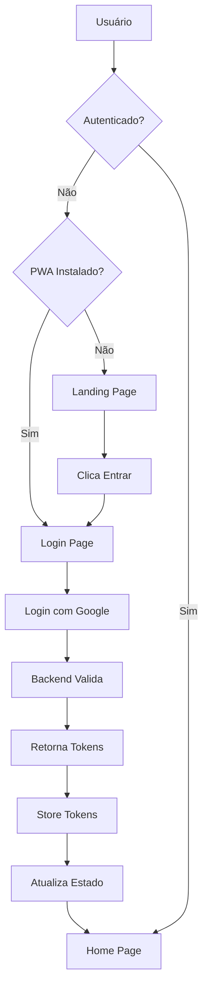
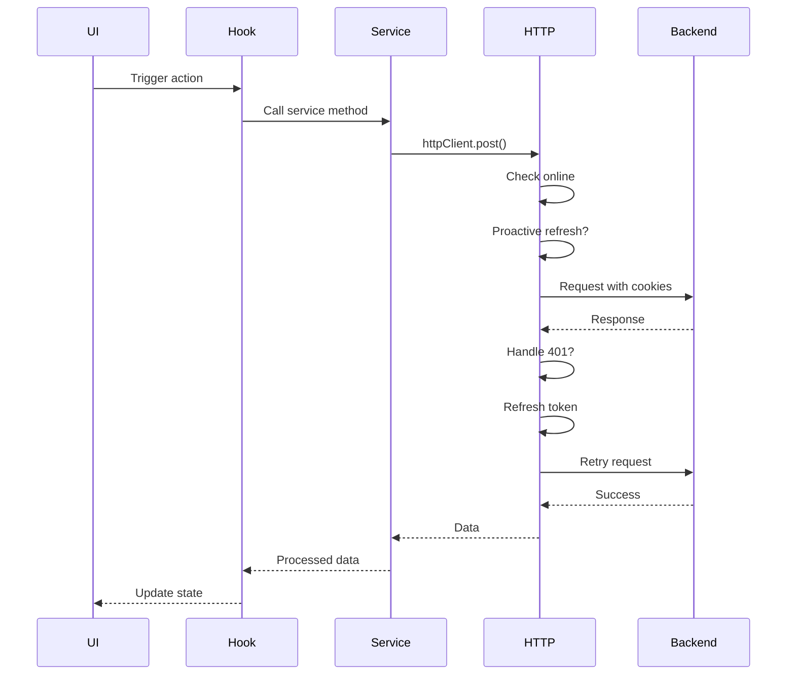

# Guia de Arquitetura - Frontend Arena Off Beach

## 🏛️ Visão Arquitetural

Sistema PWA (Progressive Web App) construído com React + Vite focado em performance, manutenibilidade e experiência do usuário otimizada para mobile.

## 📐 Padrão Arquitetural: MVC Adaptado

### Estrutura de Páginas

```
pages/
└── PageName/
    ├── page-name.page.tsx          # Entry Point (exporta Controller)
    ├── controller/
    │   └── page-name.controller.tsx # Business Logic Layer
    ├── view/
    │   └── page-name.view.tsx       # Presentation Layer
    ├── components/                  # Page-specific components
    │   ├── ComponentA.tsx
    │   └── ComponentB.tsx
    └── hooks/                       # Page-specific hooks
        ├── useCustomLogic.tsx
        └── usePageData.tsx
```

### Responsabilidades das Camadas

#### 1. Page (Entry Point)
```typescript
// page-name.page.tsx
import { PageNameController } from './controller/page-name.controller';

export const PageNamePage = PageNameController;
```

**Responsabilidade:**
- Único ponto de entrada para roteamento
- Re-exportação simples do controller

#### 2. Controller (Business Logic)
```typescript
// controller/page-name.controller.tsx
import { PageNameView } from '../view/page-name.view';
import { useCustomHook } from '../hooks/useCustomHook';

export function PageNameController() {
  // Business logic
  const { data, loading } = useCustomHook();
  
  // Event handlers
  const handleAction = () => {
    // API calls, state updates, navigation
  };
  
  // Render view with data
  return (
    <PageNameView 
      data={data}
      loading={loading}
      onAction={handleAction}
    />
  );
}
```

**Responsabilidade:**
- Gerenciar estado local da página
- Fazer chamadas de API
- Processar dados
- Definir handlers de eventos
- Passar props para a View

#### 3. View (Presentation)
```typescript
// view/page-name.view.tsx
interface PageNameViewProps {
  data: Data[];
  loading: boolean;
  onAction: () => void;
}

export function PageNameView({ data, loading, onAction }: PageNameViewProps) {
  if (loading) return <Skeleton />;
  
  return (
    <div className="container">
      {data.map(item => (
        <ItemCard key={item.id} item={item} onClick={onAction} />
      ))}
    </div>
  );
}
```

**Responsabilidade:**
- Renderização visual
- JSX/HTML structure
- Estilos (Tailwind classes)
- Composição de componentes UI
- **NUNCA** lógica de negócio

#### 4. Components (Page-specific)
```typescript
// components/ItemCard.tsx
interface ItemCardProps {
  item: Item;
  onClick: () => void;
}

export function ItemCard({ item, onClick }: ItemCardProps) {
  return (
    <Card onClick={onClick}>
      <h3>{item.title}</h3>
      <p>{item.description}</p>
    </Card>
  );
}
```

**Responsabilidade:**
- Componentes reutilizáveis dentro da página
- Encapsular partes complexas da UI
- Pode ter estado local simples (UI state only)

#### 5. Hooks (Custom Logic)
```typescript
// hooks/useCustomHook.tsx
export function useCustomHook() {
  const [data, setData] = useState([]);
  const [loading, setLoading] = useState(true);
  
  useEffect(() => {
    loadData();
  }, []);
  
  const loadData = async () => {
    try {
      const result = await api.getData();
      setData(result);
    } finally {
      setLoading(false);
    }
  };
  
  return { data, loading, reload: loadData };
}
```

**Responsabilidade:**
- Encapsular lógica complexa reutilizável
- Gerenciar side effects
- Interagir com APIs
- Manter estado compartilhado

## 🗂️ Estrutura de Diretórios

```
src/
├── components/              # Componentes globais reutilizáveis
│   ├── guards/             # Route guards (Auth, Blocked)
│   ├── layout/             # Layouts (App, Client, TabBar)
│   ├── ui/                 # UI components (shadcn/ui)
│   ├── BlockedAccountModal/
│   ├── ImageCropper/
│   ├── SplashScreen/
│   └── WavePattern/
│
├── config/                  # Configurações
│   └── firebase.ts
│
├── hooks/                   # Hooks globais
│   ├── useAuth/
│   ├── useActivityMonitor/
│   ├── useDeviceDetection/
│   ├── useNotify/
│   ├── usePushNotification/
│   ├── useSessionRenewer/
│   └── ...
│
├── lib/                     # Bibliotecas e configurações
│   ├── queryClient.tsx     # React Query config
│   └── utils.ts            # Utility functions
│
├── pages/                   # Páginas da aplicação
│   ├── Landing/            # Landing page institucional
│   ├── Login/              # Página de login
│   ├── Home/               # Home do cliente
│   ├── Cashback/           # Sistema de cashback
│   ├── Profile/            # Perfil do usuário
│   ├── EditProfile/        # Edição de perfil
│   ├── BookingDetails/     # Detalhes da reserva
│   └── Scanner/            # Scanner QR Code
│
├── services/               # Serviços de API
│   ├── api/
│   │   └── index.ts       # HTTP Client
│   └── auth.ts            # Serviço de autenticação
│
├── store/                  # State management (Zustand)
│   ├── index.ts
│   ├── authStore.ts
│   ├── userStore.ts
│   └── appStore.ts
│
├── styles/                 # Estilos globais
│   └── global.css
│
├── types/                  # TypeScript types
│   ├── index.ts
│   ├── user.ts
│   └── pwa.d.ts
│
├── utils/                  # Utilitários
│   ├── constants/         # Constantes
│   │   └── app.constant.ts
│   ├── helpers/           # Funções auxiliares
│   └── image/             # Manipulação de imagens
│
├── App.tsx                # Componente raiz
├── main.tsx              # Entry point
├── routes.tsx            # Definição de rotas
└── sw.ts                 # Service Worker
```

## 🔐 Sistema de Autenticação

### Fluxo de Autenticação



### Guards de Rota

#### PublicRoute
```typescript
function PublicRoute() {
  const { isAuthenticated, isChecking } = useAuth();
  
  if (isChecking) return <SplashScreen />;
  if (isAuthenticated) return <Navigate to={ROUTES.HOME} />;
  
  return <Outlet />;
}
```

#### ProtectedRoute
```typescript
function ProtectedRoute() {
  const { isAuthenticated, isChecking } = useAuth();
  const { isStandalone } = useDeviceDetection();
  
  if (isChecking) return <SplashScreen />;
  
  if (!isAuthenticated) {
    return <Navigate to={isStandalone ? ROUTES.LOGIN : ROUTES.LANDING} />;
  }
  
  return <Outlet />;
}
```

### HTTP Client com Renovação Automática de Token

```typescript
class HttpClient {
  // Renovação proativa de token (50 minutos)
  private shouldProactivelyRefresh(): boolean {
    const lastRefresh = this.getLastRefreshTime();
    const timeSinceRefresh = Date.now() - lastRefresh;
    return timeSinceRefresh > TOKEN_REFRESH_THRESHOLD;
  }
  
  // Interceptor automático em chamadas API
  private async request<T>(endpoint: string, config: RequestConfig) {
    // Renovação proativa
    if (!endpoint.startsWith('/auth/') && this.shouldProactivelyRefresh()) {
      await this.refreshToken();
    }
    
    const response = await fetch(url, { ...config, credentials: 'include' });
    
    // Renovação reativa em 401
    if (response.status === 401 && !_retry) {
      const refreshed = await this.refreshToken();
      if (refreshed) {
        return this.request<T>(endpoint, { ...config, _retry: true });
      }
      this.emitSessionExpired();
    }
    
    return response;
  }
}
```

## 📊 Gerenciamento de Estado

### Zustand Stores

#### Auth Store
```typescript
interface AuthState {
  isAuthenticated: boolean;
  isChecking: boolean;
  accessToken: string | null;
  refreshToken: string | null;
  
  setAuthenticated: (value: boolean) => void;
  setTokens: (access: string, refresh: string) => void;
  setIsChecking: (value: boolean) => void;
  reset: () => void;
}

const useAuthStore = create<AuthState>(
  persist(
    (set) => ({
      isAuthenticated: false,
      isChecking: true,
      accessToken: null,
      refreshToken: null,
      
      setAuthenticated: (value) => set({ isAuthenticated: value }),
      setTokens: (access, refresh) => set({ 
        accessToken: access, 
        refreshToken: refresh 
      }),
      setIsChecking: (value) => set({ isChecking: value }),
      reset: () => set({ 
        isAuthenticated: false, 
        accessToken: null, 
        refreshToken: null 
      }),
    }),
    { name: 'auth-storage' }
  )
);
```

#### User Store
```typescript
interface UserState {
  user: User | null;
  
  setUser: (user: User) => void;
  clearUserProfile: () => void;
  updateUser: (data: Partial<User>) => void;
}
```

### React Query

```typescript
// Query Client Configuration
export const queryClient = new QueryClient({
  defaultOptions: {
    queries: {
      staleTime: 1000 * 60 * 5, // 5 minutos
      cacheTime: 1000 * 60 * 30, // 30 minutos
      retry: 2,
      refetchOnWindowFocus: false,
    },
  },
});
```

**Uso em Hooks:**
```typescript
export function useBookings() {
  return useQuery({
    queryKey: ['bookings'],
    queryFn: () => BookingService.getAll(),
    enabled: isAuthenticated,
  });
}

export function useCreateBooking() {
  return useMutation({
    mutationFn: BookingService.create,
    onSuccess: () => {
      queryClient.invalidateQueries(['bookings']);
    },
  });
}
```

## 🎨 Sistema de Design

### Componentes UI (shadcn/ui)

Biblioteca de componentes baseada em Radix UI + Tailwind:

```
components/ui/
├── alert-dialog.tsx
├── alert.tsx
├── avatar.tsx
├── badge.tsx
├── button.tsx
├── card.tsx
├── dialog.tsx
├── drawer.tsx
├── form.tsx
├── input.tsx
├── label.tsx
├── select.tsx
├── separator.tsx
├── skeleton.tsx
├── sonner.tsx (toasts)
├── tabs.tsx
└── textarea.tsx
```

### Tailwind Configuration

```typescript
// tailwind.config.js
export default {
  content: ['./index.html', './src/**/*.{js,ts,jsx,tsx}'],
  theme: {
    extend: {
      colors: {
        primary: '#FF5722',
        secondary: '#FF8424',
        // ... outros
      },
      backgroundImage: {
        'linear-to-b': 'linear-gradient(to bottom, var(--tw-gradient-stops))',
        'linear-to-br': 'linear-gradient(to bottom right, var(--tw-gradient-stops))',
        // ...
      },
    },
  },
};
```

## 📱 PWA Features

### Service Worker

```typescript
// sw.ts - Service Worker para cache offline
importScripts('https://cdn.jsdelivr.net/npm/workbox-sw/...');

workbox.routing.registerRoute(
  ({ request }) => request.destination === 'image',
  new workbox.strategies.CacheFirst({
    cacheName: 'images',
    plugins: [
      new workbox.expiration.ExpirationPlugin({
        maxEntries: 60,
        maxAgeSeconds: 30 * 24 * 60 * 60, // 30 dias
      }),
    ],
  })
);
```

### Manifest (PWA Config)

```json
{
  "name": "Arena Off Beach",
  "short_name": "Arena Off",
  "start_url": "/",
  "display": "standalone",
  "background_color": "#FF5722",
  "theme_color": "#FF5722",
  "icons": [
    {
      "src": "/icon-192.png",
      "sizes": "192x192",
      "type": "image/png"
    },
    {
      "src": "/icon-512.png",
      "sizes": "512x512",
      "type": "image/png"
    }
  ]
}
```

## 🔄 Ciclo de Vida de Requisições



## ⚡ Otimizações de Performance

### 1. Code Splitting
```typescript
// Lazy loading de páginas
const LoginPage = React.lazy(() => import('./pages/Login/login.page'));
const HomePage = React.lazy(() => import('./pages/Home/home.page'));
```

### 2. Memoização
```typescript
// Controller
export function PageController() {
  const handleAction = useCallback(() => {
    // handler
  }, [deps]);
  
  const processedData = useMemo(() => {
    return data.map(transform);
  }, [data]);
}
```

### 3. Virtual Lists
```typescript
// Para listas grandes
import { useVirtualizer } from '@tanstack/react-virtual';

export function LargeList({ items }) {
  const virtualizer = useVirtualizer({
    count: items.length,
    getScrollElement: () => parentRef.current,
    estimateSize: () => 50,
  });
}
```

### 4. Debounce em Inputs
```typescript
export function useDebounce<T>(value: T, delay: number): T {
  const [debouncedValue, setDebouncedValue] = useState(value);
  
  useEffect(() => {
    const timer = setTimeout(() => setDebouncedValue(value), delay);
    return () => clearTimeout(timer);
  }, [value, delay]);
  
  return debouncedValue;
}
```

## 🧪 Estratégia de Testes (Futura)

### Unit Tests (Vitest)
```typescript
// hooks/__tests__/useAuth.test.tsx
describe('useAuth', () => {
  it('should login successfully', async () => {
    const { result } = renderHook(() => useAuth());
    await act(async () => {
      await result.current.loginWithGoogle();
    });
    expect(result.current.isAuthenticated).toBe(true);
  });
});
```

### Integration Tests (Testing Library)
```typescript
// pages/__tests__/Login.test.tsx
describe('LoginPage', () => {
  it('should redirect to home after login', async () => {
    render(<LoginPage />);
    const loginButton = screen.getByText(/entrar com google/i);
    fireEvent.click(loginButton);
    await waitFor(() => {
      expect(mockNavigate).toHaveBeenCalledWith('/home');
    });
  });
});
```

### E2E Tests (Playwright)
```typescript
// e2e/auth-flow.spec.ts
test('complete authentication flow', async ({ page }) => {
  await page.goto('/');
  await page.click('text=Entrar');
  await page.click('text=Entrar com Google');
  await expect(page).toHaveURL('/home');
});
```

## 🚨 Error Handling

### Global Error Boundary
```typescript
class ErrorBoundary extends React.Component {
  componentDidCatch(error: Error, errorInfo: React.ErrorInfo) {
    console.error('Error caught:', error, errorInfo);
    // Enviar para serviço de logging (Sentry, etc)
  }
  
  render() {
    if (this.state.hasError) {
      return <ErrorFallback />;
    }
    return this.props.children;
  }
}
```

### API Error Handling
```typescript
try {
  await api.call();
} catch (error) {
  if (error.status === 401) {
    // Handle unauthorized
  } else if (error.status >= 500) {
    showError('Erro no servidor. Tente novamente.');
  } else {
    showError(error.message);
  }
}
```

## 📚 Convenções e Best Practices

### 1. Naming Conventions
- Components: `PascalCase`
- Files: `kebab-case.tsx`
- Hooks: `camelCase` starting with `use`
- Constants: `UPPER_SNAKE_CASE`
- Types/Interfaces: `PascalCase`

### 2. File Organization
- One component per file
- Group related files in folders
- Index files for clean imports

### 3. TypeScript
- Always type props and return values
- Use interfaces for complex objects
- Prefer `unknown` over `any`
- Export reusable types

### 4. Component Design
- Keep components small and focused
- Extract complex logic to hooks
- Use composition over props drilling
- Prefer controlled components

### 5. State Management
- Local state for UI-only concerns
- Zustand for global app state
- React Query for server state
- Context for theme/config

## 🔗 Recursos e Referências

- [React Documentation](https://react.dev)
- [Vite Documentation](https://vitejs.dev)
- [Tailwind CSS](https://tailwindcss.com)
- [React Router](https://reactrouter.com)
- [Zustand](https://zustand-demo.pmnd.rs)
- [React Query](https://tanstack.com/query)
- [shadcn/ui](https://ui.shadcn.com)

---

**Versão**: 1.0.0  
**Data**: 19/03/2026  
**Status**: ✅ Documentação Completa
