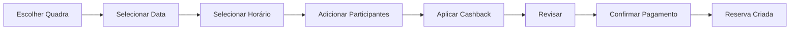

# Checklist de Implementação - Arena Off Beach Frontend

## ✅ Concluído

### Infraestrutura Base
- [x] Estrutura de pastas seguindo padrão MVC
- [x] Sistema de rotas com React Router
- [x] Configuração do Tailwind CSS
- [x] Service Worker (PWA)
- [x] HTTP Client com refresh token automático
- [x] Stores Zustand (Auth, User, App)
- [x] React Query configurado
- [x] Componentes UI (shadcn/ui)

### Páginas
- [x] Landing Page institucional
- [x] Login Page com Google OAuth
- [x] Layout base para páginas autenticadas

### Features
- [x] Sistema de detecção de PWA instalado
- [x] Guards de rotas (Public/Protected)
- [x] Lógica de redirecionamento inteligente
- [x] Serviço de autenticação
- [x] Splash screen

### Documentação
- [x] LANDING_AND_LOGIN_IMPLEMENTATION.md
- [x] ARCHITECTURE_GUIDE.md
- [x] CHECKLIST.md (este arquivo)

## 🚧 Em Desenvolvimento

### Nenhum item no momento

## 📋 Próximos Passos

### 1. Integração com Firebase (ALTA PRIORIDADE)

#### Setup Firebase
- [ ] Criar projeto no Firebase Console
- [ ] Configurar Google OAuth
- [ ] Obter credenciais (API Key, Auth Domain, etc)
- [ ] Adicionar ao `.env`

#### Implementação
```typescript
// src/config/firebase.ts
import { initializeApp } from 'firebase/app';
import { getAuth, GoogleAuthProvider, signInWithPopup } from 'firebase/auth';

const firebaseConfig = {
  apiKey: import.meta.env.VITE_FIREBASE_API_KEY,
  authDomain: import.meta.env.VITE_FIREBASE_AUTH_DOMAIN,
  projectId: import.meta.env.VITE_FIREBASE_PROJECT_ID,
  // ...
};

const app = initializeApp(firebaseConfig);
export const auth = getAuth(app);
export const googleProvider = new GoogleAuthProvider();

export async function signInWithGoogle() {
  const result = await signInWithPopup(auth, googleProvider);
  const idToken = await result.user.getIdToken();
  
  // Enviar para backend
  return {
    idToken,
    email: result.user.email,
    name: result.user.displayName,
    googleId: result.user.uid,
    avatarUrl: result.user.photoURL,
  };
}
```

#### Atualizar Login
- [ ] Conectar botão "Entrar com Google" ao Firebase
- [ ] Obter ID Token
- [ ] Enviar para backend `/auth/google`
- [ ] Salvar tokens retornados
- [ ] Redirecionar para home

### 2. Página Home (ALTA PRIORIDADE)

#### Estrutura
```
Home/
├── home.page.tsx
├── controller/
│   └── home.controller.tsx
├── view/
│   └── home.view.tsx
├── components/
│   ├── QuickActions.tsx
│   ├── ActivePromotions.tsx
│   ├── RecentBookings.tsx
│   └── WelcomeHeader.tsx
└── hooks/
    ├── useActivePromotions.tsx
    └── useRecentBookings.tsx
```

#### Features
- [ ] Header com boas-vindas e avatar
- [ ] Ações rápidas (Nova Reserva, Ver Cashback, Escanear)
- [ ] Promoções ativas
- [ ] Últimas reservas
- [ ] Estatísticas rápidas (cashback disponível, próximas reservas)

#### APIs necessárias
- [ ] GET `/bookings/recent` - Últimas reservas
- [ ] GET `/promotions/active` - Promoções ativas
- [ ] GET `/cashback/balance` - Saldo de cashback

### 3. Sistema de Reservas (ALTA PRIORIDADE)

#### Páginas
- [ ] Lista de Quadras (`/courts`)
- [ ] Disponibilidade (`/courts/:id/availability`)
- [ ] Nova Reserva (`/bookings/new`)
- [ ] Minhas Reservas (`/bookings`)
- [ ] Detalhes da Reserva (`/bookings/:id`)

#### Fluxo de Reserva


#### Componentes
- [ ] CourtCard - Card de quadra
- [ ] CalendarPicker - Seletor de data
- [ ] TimeSlotPicker - Seletor de horário
- [ ] ParticipantsList - Lista de participantes
- [ ] PriceSummary - Resumo de preços
- [ ] PaymentMethods - Métodos de pagamento

### 4. Sistema de Cashback (MÉDIA PRIORIDADE)

#### Cashback Page
```
Cashback/
├── cashback.page.tsx
├── controller/
│   └── cashback.controller.tsx
├── view/
│   └── cashback.view.tsx
├── components/
│   ├── CashbackBalance.tsx
│   ├── TransactionsList.tsx
│   ├── QRScanner.tsx
│   └── HowItWorks.tsx
└── hooks/
    ├── useCashbackBalance.tsx
    ├── useCashbackTransactions.tsx
    └── useQRScanner.tsx
```

#### Features
- [ ] Exibir saldo atual
- [ ] Histórico de transações (ganhos e gastos)
- [ ] Scanner de QR Code (consumo no bar)
- [ ] Como funciona o cashback
- [ ] Regras e percentuais

#### APIs necessárias
- [ ] GET `/cashback/balance`
- [ ] GET `/cashback/transactions`
- [ ] POST `/cashback/redeem` - Escanear QR Code

### 5. Perfil e Configurações (MÉDIA PRIORIDADE)

#### Profile Page
- [ ] Informações do usuário
- [ ] Avatar (upload)
- [ ] Estatísticas (total de reservas, cashback acumulado)
- [ ] Botão de logout

#### Edit Profile Page
- [ ] Formulário de edição
- [ ] Upload de avatar com crop
- [ ] Validação de dados
- [ ] Botão salvar

#### APIs necessárias
- [ ] GET `/users/profile`
- [ ] PUT `/users/profile`
- [ ] POST `/users/avatar` - Upload de imagem

### 6. Scanner QR Code (MÉDIA PRIORIDADE)

#### Scanner Page
- [ ] Câmera para escanear QR Code
- [ ] Validação de QR Code
- [ ] Exibir valor do cashback ganho
- [ ] Histórico de scans recentes

#### Biblioteca
```bash
npm install @zxing/library
```

#### Implementação
```typescript
import { BrowserMultiFormatReader } from '@zxing/library';

export function useQRScanner() {
  const scan = async () => {
    const reader = new BrowserMultiFormatReader();
    const result = await reader.decodeFromVideoDevice();
    return result.getText();
  };
}
```

### 7. Push Notifications (BAIXA PRIORIDADE)

#### Setup
- [ ] Configurar Firebase Cloud Messaging
- [ ] Pedir permissão ao usuário
- [ ] Salvar token no backend
- [ ] Ouvir notificações

#### Casos de Uso
- Reserva confirmada
- Lembrete de reserva (1h antes)
- Cashback recebido
- Promoção disponível

### 8. Offline Support (BAIXA PRIORIDADE)

#### Features
- [ ] Cache de dados essenciais
- [ ] Indicador de status online/offline
- [ ] Fila de ações offline
- [ ] Sincronização ao voltar online

### 9. Testes

#### Unit Tests
- [ ] Hooks (useAuth, useDeviceDetection, etc)
- [ ] Utils functions
- [ ] Services (auth, api)

#### Integration Tests
- [ ] Login flow
- [ ] Booking flow
- [ ] Cashback redemption

#### E2E Tests
- [ ] Complete user journey
- [ ] PWA installation
- [ ] Offline scenarios

### 10. Otimizações

#### Performance
- [ ] Lazy loading de imagens
- [ ] Virtual scrolling para listas grandes
- [ ] Debounce em buscas
- [ ] Memoização de componentes pesados

#### SEO (Landing Page)
- [ ] Meta tags
- [ ] Open Graph
- [ ] Structured data
- [ ] Sitemap

#### Analytics
- [ ] Google Analytics / Posthog
- [ ] Event tracking (login, booking, etc)
- [ ] Error tracking (Sentry)

## 🎨 Melhorias de UI/UX

### Animações
- [ ] Transições de página
- [ ] Loading states
- [ ] Skeleton screens
- [ ] Empty states

### Feedback Visual
- [ ] Toasts para ações (sucesso, erro)
- [ ] Confirmações para ações destrutivas
- [ ] Estados de loading em botões

### Acessibilidade
- [ ] ARIA labels
- [ ] Navegação por teclado
- [ ] Contraste de cores
- [ ] Tamanhos de fonte

## 🔧 DevOps e Deploy

### CI/CD
- [ ] GitHub Actions
- [ ] Build automático
- [ ] Testes automáticos
- [ ] Deploy automático

### Ambientes
- [ ] Development (local)
- [ ] Staging (teste)
- [ ] Production (produção)

### Hosting
- [ ] Vercel / Netlify / Firebase Hosting
- [ ] Configurar domínio
- [ ] SSL/HTTPS
- [ ] CDN

### Monitoramento
- [ ] Uptime monitoring
- [ ] Error tracking (Sentry)
- [ ] Performance monitoring
- [ ] User analytics

## 📱 App Store (Futuro)

### PWA to Native
- [ ] Capacitor / Tauri para apps nativos
- [ ] Play Store (Android)
- [ ] App Store (iOS)
- [ ] Splash screens nativas
- [ ] Deep linking

## 🔒 Segurança

### Implementações Necessárias
- [ ] Rate limiting no frontend
- [ ] Validação de inputs
- [ ] Sanitização de dados
- [ ] CSP (Content Security Policy)
- [ ] HTTPS only
- [ ] Secure cookies

### Boas Práticas
- [ ] Não expor secrets no código
- [ ] Validar tokens no backend
- [ ] Logout em múltiplas sessões
- [ ] Timeout de sessão

## 📚 Documentação Adicional

### Para Desenvolvedores
- [ ] Contributing Guidelines
- [ ] Code of Conduct
- [ ] API Documentation
- [ ] Component Storybook

### Para Usuários
- [ ] User Guide
- [ ] FAQ
- [ ] Terms of Service
- [ ] Privacy Policy

## 🐛 Bugs Conhecidos

### Nenhum no momento

## 💡 Ideias Futuras

### Features Interessantes
- [ ] Sistema de avaliações (review de quadras)
- [ ] Chat entre participantes de uma reserva
- [ ] Compartilhar reserva nas redes sociais
- [ ] Torneios e ligas
- [ ] Ranking de jogadores
- [ ] Sistema de indicação (referral)
- [ ] Modo escuro
- [ ] Multi-idioma (i18n)
- [ ] Integração com calendário (Google Calendar)
- [ ] Lembretes customizáveis
- [ ] Histórico de partidas
- [ ] Estatísticas avançadas

## 📊 Métricas de Sucesso

### KPIs
- Taxa de conversão (visitante → usuário cadastrado)
- Taxa de reservas completadas
- Tempo médio no app
- Retenção de usuários (D1, D7, D30)
- Cashback utilizado vs acumulado
- NPS (Net Promoter Score)

### Metas Técnicas
- Lighthouse Score > 90
- FCP < 1.5s
- LCP < 2.5s
- TTI < 3.5s
- Bundle size < 500kb
- Uptime > 99.9%

---

## 📝 Notas de Atualização

**Última atualização**: 19/03/2026  
**Versão**: 1.0.0  
**Status**: Base implementada, próximas features em planejamento

### Como usar este checklist:
1. Marcar itens concluídos com [x]
2. Adicionar novos itens conforme necessário
3. Priorizar baseado em valor para o usuário
4. Revisar semanalmente o progresso
5. Mover itens entre seções (Em Desenvolvimento, Concluído)

### Priorização:
- **ALTA**: Bloqueadores, features essenciais
- **MÉDIA**: Features importantes mas não bloqueadoras
- **BAIXA**: Nice to have, otimizações

---

**Mantenha este documento atualizado! É o mapa do projeto.**
