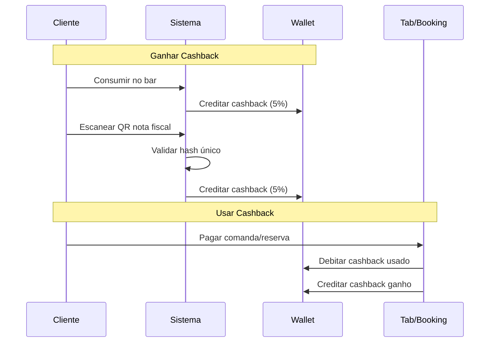

# Sistema de Cashback

## Visão Geral

O Sistema de Cashback permite que clientes acumulem créditos através de:
1. **Consumo no bar** (comandas pagas)
2. **Scanner de QR Code** de notas fiscais externas

Os créditos podem ser usados como desconto em futuras comandas ou reservas.

## Fluxo Completo



## Conceitos

### Carteira (Wallet)
Cada cliente possui uma carteira com:
- **balance**: Saldo disponível
- **blockedBalance**: Saldo bloqueado (reservas pendentes)
- **totalEarned**: Total acumulado histórico
- **totalSpent**: Total gasto histórico

### Tipos de Transação
| Tipo | Descrição | Valor |
|------|-----------|-------|
| `EARNED_CONSUMPTION` | Ganho em consumo (bar) | + |
| `EARNED_BONUS` | Ganho via QR Code | + |
| `USED_TAB` | Usado em comanda | - |
| `USED_BOOKING` | Usado em reserva | - |
| `REFUND` | Estorno/devolução | + |
| `EXPIRATION` | Expiração de crédito | - |

### Configurações (Admin)
```json
{
  "defaultCashbackPercentage": 5,
  "minPurchaseAmount": 10,
  "expirationDays": 365,
  "maxCashbackPerTransaction": 500
}
```

## Endpoints - Cliente

### 1. Consultar Carteira
**GET** `/cashback/wallet`

**Permissões:** CLIENT

**Response 200:**
```json
{
  "id": "uuid",
  "clientId": "uuid",
  "balance": 87.50,
  "blockedBalance": 0,
  "totalEarned": 250.00,
  "totalSpent": 162.50,
  "createdAt": "2026-01-10T10:00:00Z",
  "updatedAt": "2026-03-18T15:30:00Z",
  "recentTransactions": [
    {
      "id": "uuid",
      "type": "EARNED_CONSUMPTION",
      "amount": 12.50,
      "notes": "Cashback earned from tab CMD045",
      "createdAt": "2026-03-18T14:00:00Z"
    },
    {
      "id": "uuid",
      "type": "USED_TAB",
      "amount": -20.00,
      "notes": "Cashback used on tab CMD042",
      "createdAt": "2026-03-17T19:30:00Z"
    }
  ]
}
```

---

### 2. Histórico de Transações
**GET** `/cashback/transactions?type=EARNED_CONSUMPTION&limit=50`

**Permissões:** CLIENT

**Query Parameters:**
- `type`: Filtrar por tipo de transação
- `startDate`: Data inicial (YYYY-MM-DD)
- `endDate`: Data final (YYYY-MM-DD)
- `limit`: Quantidade de resultados (padrão: 50)

**Response 200:**
```json
[
  {
    "id": "uuid",
    "type": "EARNED_CONSUMPTION",
    "amount": 12.50,
    "notes": "Cashback earned from tab CMD045",
    "tabId": "uuid-comanda",
    "createdAt": "2026-03-18T14:00:00Z"
  },
  {
    "id": "uuid",
    "type": "EARNED_BONUS",
    "amount": 8.75,
    "notes": "Cashback from QR receipt - 12345678901234",
    "qrReceiptId": "uuid-nota",
    "createdAt": "2026-03-15T10:20:00Z"
  }
]
```

---

### 3. Escanear QR Code de Nota Fiscal
**POST** `/cashback/qr-receipt`

**Permissões:** CLIENT

**Body:**
```json
{
  "hash": "a1b2c3d4e5f6g7h8i9j0",
  "amount": 175.00,
  "cnpj": "12345678000190",
  "issueDate": "2026-03-18"
}
```

**Campos:**
- `hash` (obrigatório): Hash único da nota fiscal (QR Code)
- `amount` (obrigatório): Valor total da nota
- `cnpj` (opcional): CNPJ do estabelecimento
- `issueDate` (opcional): Data de emissão

**Validações:**
1. Hash não pode ser duplicado (nota já processada)
2. Valor deve ser ≥ `minPurchaseAmount` (padrão R$ 10)
3. Cashback limitado a `maxCashbackPerTransaction` (padrão R$ 500)

**Cálculo:**
```javascript
cashback = min(
  amount * (defaultCashbackPercentage / 100),
  maxCashbackPerTransaction
)

// Exemplo: R$ 175 * 5% = R$ 8,75
```

**Response 201:**
```json
{
  "id": "uuid",
  "hash": "a1b2c3d4e5f6g7h8i9j0",
  "amount": 175.00,
  "cnpj": "12345678000190",
  "processed": true,
  "cashbackGenerated": 8.75,
  "createdAt": "2026-03-18T16:00:00Z",
  "processedAt": "2026-03-18T16:00:01Z"
}
```

**Erros:**
```json
// 400 - Nota já processada
{
  "message": "Receipt already processed"
}

// 400 - Valor mínimo
{
  "message": "Minimum purchase amount is 10"
}
```

---

### 4. Minhas Notas Fiscais
**GET** `/cashback/qr-receipts?processed=true`

**Permissões:** CLIENT

**Query Parameters:**
- `used`: true | false
- `processed`: true | false
- `startDate`, `endDate`: Filtros de data

**Response 200:**
```json
[
  {
    "id": "uuid",
    "hash": "a1b2c3d4...",
    "amount": 175.00,
    "processed": true,
    "cashbackGenerated": 8.75,
    "createdAt": "2026-03-18T16:00:00Z"
  }
]
```

---

## Endpoints - Admin

### 5. Listar Todas Carteiras
**GET** `/cashback/admin/wallets?minBalance=50`

**Permissões:** ADMIN

**Query Parameters:**
- `minBalance`: Saldo mínimo
- `maxBalance`: Saldo máximo
- `startDate`, `endDate`: Data de criação

**Response 200:**
```json
[
  {
    "id": "uuid",
    "clientId": "uuid",
    "balance": 87.50,
    "totalEarned": 250.00,
    "totalSpent": 162.50,
    "createdAt": "2026-01-10T10:00:00Z"
  }
]
```

---

### 6. Dashboard de Cashback
**GET** `/cashback/admin/summary`

**Permissões:** ADMIN

**Response 200:**
```json
{
  "totalWallets": 1250,
  "totalBalance": 125750.00,
  "totalEarned": 458920.00,
  "totalSpent": 333170.00,
  "totalTransactions": 12847
}
```

**Métricas:**
- Total de carteiras ativas
- Saldo total em circulação
- Total já distribuído (histórico)
- Total já utilizado pelos clientes
- Número total de transações

---

### 7. Consultar Configurações
**GET** `/cashback/admin/config`

**Permissões:** ADMIN

**Response 200:**
```json
{
  "defaultCashbackPercentage": 5,
  "minPurchaseAmount": 10,
  "expirationDays": 365,
  "maxCashbackPerTransaction": 500
}
```

---

### 8. Atualizar Configurações
**PATCH** `/cashback/admin/config`

**Permissões:** ADMIN

**Body:**
```json
{
  "defaultCashbackPercentage": 7,
  "minPurchaseAmount": 15,
  "maxCashbackPerTransaction": 300
}
```

**Campos (todos opcionais):**
- `defaultCashbackPercentage`: 0-100 (%)
- `minPurchaseAmount`: Valor mínimo em R$
- `expirationDays`: Dias para expiração
- `maxCashbackPerTransaction`: Limite por transação

**Response 200:** Configurações atualizadas

---

## Regras de Negócio

### 1. Ganho de Cashback

#### Via Consumo (Comandas)
- Calculado automaticamente ao pagar comanda
- Usa `product.cashbackPercent` específico de cada produto
- Creditado após confirmação do pagamento
- Exige `clientId` na comanda

**Exemplo:**
```
Produto A: R$ 50 (5% cashback) = R$ 2,50
Produto B: R$ 30 (10% cashback) = R$ 3,00
Total cashback = R$ 5,50
```

#### Via QR Code (Notas Externas)
- Usa `defaultCashbackPercentage` global
- Hash deve ser único (não duplicar)
- Valor mínimo configurável
- Limitado por `maxCashbackPerTransaction`

**Exemplo:**
```
Nota: R$ 200
Percentual: 5%
Cashback = R$ 10

Se maxCashbackPerTransaction = R$ 8
Cashback final = R$ 8 (limitado)
```

### 2. Uso de Cashback

#### Prioridades
1. Verifica saldo disponível
2. Valida valor não exceder total
3. Debita antes de confirmar pagamento
4. Registra transação com referência

#### Em Comandas
```bash
POST /tabs/:id/payment
{
  "method": "MIXED",
  "amount": 100.00,
  "cashbackUsed": 25.00  # Cliente paga R$ 75
}
```

#### Em Reservas (Bookings)
Mesmo princípio aplicado em reservas de quadras.

### 3. Validações

#### Scanner QR Code
```javascript
// Validação 1: Hash único
const existing = await findByHash(hash);
if (existing && existing.processed) {
  throw "Receipt already processed";
}

// Validação 2: Valor mínimo
if (amount < minPurchaseAmount) {
  throw `Minimum purchase amount is ${minPurchaseAmount}`;
}

// Validação 3: Limite por transação
const cashback = Math.min(
  amount * (percentage / 100),
  maxCashbackPerTransaction
);
```

#### Uso em Pagamento
```javascript
// Validação 1: Cliente tem saldo
if (wallet.balance < cashbackUsed) {
  throw "Insufficient cashback balance";
}

// Validação 2: Não exceder total
if (cashbackUsed > totalAmount) {
  throw "Cashback amount exceeds total";
}

// Validação 3: Cliente autenticado
if (!clientId) {
  throw "Cannot use cashback without a client";
}
```

### 4. Transações Atômicas

Toda operação de cashback usa transações do banco:
```javascript
// Exemplo: Pagamento com cashback
await prisma.$transaction([
  // 1. Debitar cashback usado
  debitWallet(cashbackUsed, 'USED_TAB'),
  
  // 2. Criar pagamento
  createPayment(paymentData),
  
  // 3. Creditar cashback ganho
  creditWallet(cashbackEarned, 'EARNED_CONSUMPTION')
]);
```

## Integrações

### Com Módulo de Comandas (Tabs)
1. **Ganho:** Ao pagar comanda, credita cashback na carteira
2. **Uso:** Permite usar cashback como forma de pagamento
3. **Validação:** Verifica saldo antes de processar

### Com Módulo de Reservas (Bookings)
Similar ao fluxo de comandas.

### Com Módulo de Produtos
Cada produto define seu próprio `cashbackPercent`:
```javascript
// Exemplo de produtos
Cerveja: 5% cashback
Caipirinha: 10% cashback
Porção: 8% cashback
```

## Exemplos de Uso

### Exemplo 1: Cliente Escaneia Nota

```bash
# Cliente comprou em mercado vizinho
curl -X POST http://localhost:3000/cashback/qr-receipt \
  -H "Authorization: Bearer $CLIENT_TOKEN" \
  -H "Content-Type: application/json" \
  -d '{
    "hash": "NF123ABC456DEF789GHI",
    "amount": 85.00,
    "cnpj": "12345678000190",
    "issueDate": "2026-03-18"
  }'

# Resposta
{
  "cashbackGenerated": 4.25,
  "processed": true
}

# Cliente ganha R$ 4,25 na carteira
```

### Exemplo 2: Cliente Usa Cashback

```bash
# 1. Consultar saldo
curl -X GET http://localhost:3000/cashback/wallet \
  -H "Authorization: Bearer $CLIENT_TOKEN"

# Saldo: R$ 45,00

# 2. Usar R$ 30 em comanda de R$ 100
curl -X POST http://localhost:3000/tabs/uuid/payment \
  -H "Authorization: Bearer $EMPLOYEE_TOKEN" \
  -d '{
    "method": "MIXED",
    "amount": 100.00,
    "cashbackUsed": 30.00
  }'

# Cliente paga R$ 70 + ganha cashback da compra
```

### Exemplo 3: Admin Monitora Sistema

```bash
# Ver resumo geral
curl -X GET http://localhost:3000/cashback/admin/summary \
  -H "Authorization: Bearer $ADMIN_TOKEN"

# Ver carteiras com saldo alto
curl -X GET 'http://localhost:3000/cashback/admin/wallets?minBalance=100' \
  -H "Authorization: Bearer $ADMIN_TOKEN"

# Aumentar percentual de cashback
curl -X PATCH http://localhost:3000/cashback/admin/config \
  -H "Authorization: Bearer $ADMIN_TOKEN" \
  -d '{
    "defaultCashbackPercentage": 7
  }'
```

## Estratégias de Negócio

### 1. Fidelização via Cashback Progressivo
```javascript
// Exemplo de implementação futura
if (customer.purchasesThisMonth > 10) {
  cashbackPercent = 10; // Dobra para clientes frequentes
}
```

### 2. Promoções Temporárias
```javascript
// Exemplo: Happy hour com cashback em dobro
if (isHappyHour && product.category === 'BEBIDAS') {
  cashbackPercent = product.cashbackPercent * 2;
}
```

### 3. Limites de Uso
```javascript
// Usar no máximo 50% em cashback
const maxCashbackUsage = totalAmount * 0.5;
if (cashbackUsed > maxCashbackUsage) {
  throw "Max 50% cashback per transaction";
}
```

## Relatórios Admin

### Análise de Distribuição
```sql
-- Top 10 clientes com mais cashback
SELECT clientId, balance, totalEarned
FROM cashback_wallets
ORDER BY totalEarned DESC
LIMIT 10;

-- Cashback por período
SELECT 
  DATE(createdAt) as date,
  SUM(CASE WHEN amount > 0 THEN amount ELSE 0 END) as earned,
  SUM(CASE WHEN amount < 0 THEN ABS(amount) ELSE 0 END) as spent
FROM cashback_transactions
WHERE createdAt >= '2026-03-01'
GROUP BY DATE(createdAt);
```

### Efetividade do Programa
```javascript
// Taxa de conversão (uso vs ganho)
const conversionRate = (totalSpent / totalEarned) * 100;

// Exemplo: 60% = boa adesão
// Se < 30% = clientes não estão usando
```

## Boas Práticas

1. **Sempre valide o hash de QR Code** para evitar fraudes
2. **Monitore saldos altos** (possíveis anomalias)
3. **Configure limite razoável** (evita abuso)
4. **Use expiração** para rotacionar créditos
5. **Incentive uso** mandando notificações de saldo
6. **Analise taxas de conversão** regularmente

## Códigos de Erro

| Código | Mensagem | Solução |
|--------|----------|---------|
| 400 | Receipt already processed | QR Code já foi usado |
| 400 | Minimum purchase amount is X | Valor da nota muito baixo |
| 400 | Insufficient cashback balance | Cliente sem saldo |
| 400 | Cannot use cashback without a client | Comanda sem clientId |
| 404 | Wallet not found | Cliente não tem carteira ainda |

## Segurança

### Hash de Nota Fiscal
- Use hash único gerado pelo governo (NFC-e)
- Valide formato antes de processar
- Impeça duplicação

### Auditoria
Todas transações ficam registradas:
```javascript
{
  id: "uuid",
  walletId: "uuid",
  type: "USED_TAB",
  amount: -25.00,
  tabId: "uuid-comanda",  // Rastreabilidade
  createdAt: "2026-03-18T10:00:00Z"
}
```

### Controle de Acesso
- **CLIENT:** Apenas sua própria carteira
- **EMPLOYEE:** Não acessa cashback diretamente
- **ADMIN:** Acesso total + configurações

## Roadmap Futuro

- [ ] Expiração automática de créditos
- [ ] Cashback progressivo (níveis VIP)
- [ ] Transferência entre clientes
- [ ] Cashback em reservas antecipadas
- [ ] Notificações de saldo
- [ ] Gamificação (badges, metas)
