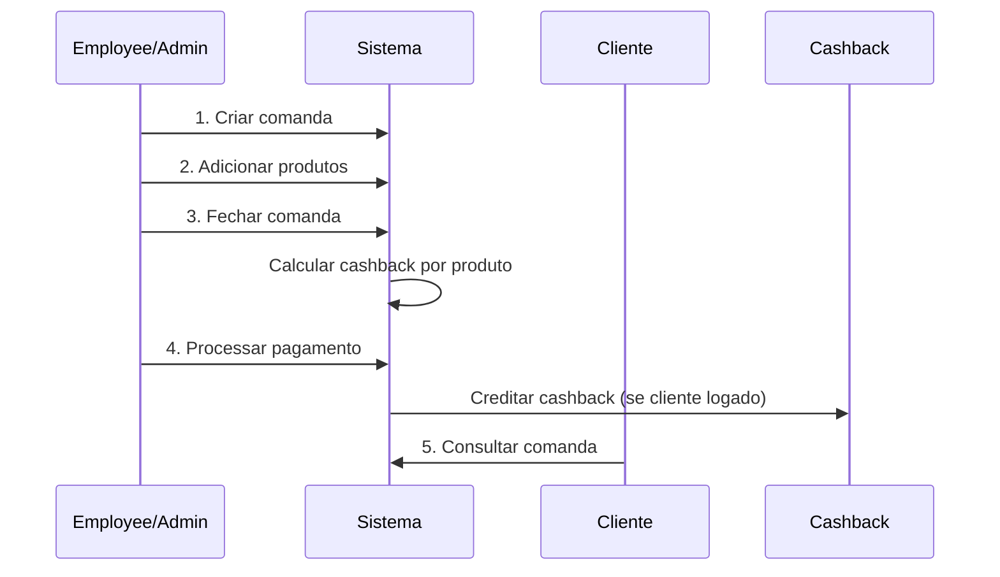

# Gerenciamento de Comandas (Tabs)

## Visão Geral

O módulo de Comandas (Tabs) permite que ADMIN e EMPLOYEE gerenciem o consumo de produtos no bar/restaurante da arena. Clientes podem visualizar suas próprias comandas.

## Fluxo Completo



## Endpoints

### 1. Criar Comanda
**POST** `/tabs`

**Permissões:** ADMIN, EMPLOYEE

**Body:**
```json
{
  "number": "CMD001",
  "table": "Mesa 15",
  "courtId": "uuid-quadra",
  "clientId": "uuid-cliente",
  "clientName": "João Silva",
  "notes": "Cliente preferencial"
}
```

**Campos:**
- `number` (obrigatório): Número único da comanda
- `table` (opcional): Mesa/local
- `courtId` (opcional): Quadra associada
- `clientId` (opcional): Cliente logado (para cashback)
- `clientName` (opcional): Nome de cliente não logado
- `notes` (opcional): Observações

**Response 201:**
```json
{
  "id": "uuid",
  "number": "CMD001",
  "table": "Mesa 15",
  "status": "OPEN",
  "subtotal": 0,
  "discount": 0,
  "surcharge": 0,
  "total": 0,
  "cashbackEarned": 0,
  "createdAt": "2026-03-18T10:00:00Z",
  "items": []
}
```

---

### 2. Listar Comandas
**GET** `/tabs?status=OPEN&numberSearch=CMD&startDate=2026-03-01&endDate=2026-03-18`

**Permissões:** ADMIN, EMPLOYEE

**Query Parameters:**
- `status`: OPEN | CLOSED | PAID | CANCELLED
- `clientId`: UUID do cliente
- `courtId`: UUID da quadra
- `numberSearch`: Busca parcial no número
- `startDate`: Data inicial (YYYY-MM-DD)
- `endDate`: Data final (YYYY-MM-DD)

**Response 200:**
```json
[
  {
    "id": "uuid",
    "number": "CMD001",
    "status": "OPEN",
    "total": 150.00,
    "items": [...],
    "createdAt": "2026-03-18T10:00:00Z"
  }
]
```

---

### 3. Minhas Comandas (Cliente)
**GET** `/tabs/my-tabs?status=OPEN`

**Permissões:** CLIENT

Retorna apenas comandas do cliente autenticado.

---

### 4. Resumo Diário
**GET** `/tabs/summary?date=2026-03-18`

**Permissões:** ADMIN, EMPLOYEE

**Response 200:**
```json
{
  "openTabs": 12,
  "closedTabs": 45,
  "totalSales": 8750.50,
  "totalCashback": 437.52
}
```

---

### 5. Buscar por Número
**GET** `/tabs/number/CMD001`

**Permissões:** ADMIN, EMPLOYEE

Busca exata por número da comanda.

---

### 6. Detalhes da Comanda
**GET** `/tabs/:id`

**Permissões:** ADMIN, EMPLOYEE

**Response 200:**
```json
{
  "id": "uuid",
  "number": "CMD001",
  "status": "OPEN",
  "subtotal": 150.00,
  "discount": 0,
  "surcharge": 0,
  "total": 150.00,
  "cashbackEarned": 7.50,
  "items": [
    {
      "id": "uuid",
      "productName": "Cerveja Heineken",
      "quantity": 6,
      "unitPrice": 15.00,
      "subtotal": 90.00,
      "cancelled": false
    },
    {
      "id": "uuid",
      "productName": "Caipirinha",
      "quantity": 3,
      "unitPrice": 20.00,
      "subtotal": 60.00,
      "cancelled": false
    }
  ],
  "payments": []
}
```

---

### 7. Adicionar Produto
**POST** `/tabs/:id/items`

**Permissões:** ADMIN, EMPLOYEE

**Body:**
```json
{
  "productId": "uuid-produto",
  "quantity": 2,
  "notes": "Sem gelo"
}
```

**Response 200:** Comanda atualizada com novo item

---

### 8. Remover Produto
**DELETE** `/tabs/:id/items/:itemId`

**Permissões:** ADMIN, EMPLOYEE

Remove completamente o item da comanda (apenas comandas OPEN).

---

### 9. Cancelar Produto
**PATCH** `/tabs/:id/items/:itemId/cancel`

**Permissões:** ADMIN, EMPLOYEE

Marca o item como cancelado (não remove, mantém histórico).

---

### 10. Fechar Comanda
**POST** `/tabs/:id/close`

**Permissões:** ADMIN, EMPLOYEE

**Body:**
```json
{
  "discount": 10.00,
  "surcharge": 5.00,
  "notes": "10% desconto cortesia"
}
```

**Cálculo:**
- Subtotal: soma de todos os itens não cancelados
- Cashback: soma de (item.subtotal * produto.cashbackPercent / 100)
- Total: subtotal - discount + surcharge

**Response 200:**
```json
{
  "id": "uuid",
  "status": "CLOSED",
  "subtotal": 150.00,
  "discount": 10.00,
  "surcharge": 5.00,
  "total": 145.00,
  "cashbackEarned": 7.50,
  "closedAt": "2026-03-18T11:30:00Z"
}
```

---

### 11. Processar Pagamento
**POST** `/tabs/:id/payment`

**Permissões:** ADMIN, EMPLOYEE

**Body:**
```json
{
  "method": "PIX",
  "amount": 145.00,
  "cashbackUsed": 20.00,
  "transactionId": "PIX123456",
  "notes": "Pagamento via PIX"
}
```

**Métodos aceitos:**
- `CASH` - Dinheiro
- `PIX` - Transferência PIX
- `CREDIT_CARD` - Cartão de crédito
- `DEBIT_CARD` - Cartão de débito
- `CASHBACK` - Pagamento 100% com cashback
- `MIXED` - Misto (dinheiro + cartão, etc)

**Validações:**
- Comanda deve estar CLOSED
- Se usar cashback, cliente deve ter saldo suficiente
- Cashback usado não pode exceder o total

**Fluxo:**
1. Valida saldo de cashback (se aplicável)
2. Debita cashback usado da carteira
3. Cria registro de pagamento
4. Atualiza status para PAID
5. Credita cashback ganho na carteira do cliente

**Response 200:** Comanda com status PAID

---

### 12. Cancelar Comanda
**PATCH** `/tabs/:id/cancel`

**Permissões:** ADMIN, EMPLOYEE

Cancela a comanda (não permite cancelar comandas já pagas).

---

## Status da Comanda

| Status | Descrição | Ações Permitidas |
|--------|-----------|------------------|
| **OPEN** | Comanda aberta | Adicionar/remover/cancelar itens, fechar |
| **CLOSED** | Comanda fechada | Processar pagamento, cancelar |
| **PAID** | Comanda paga | Apenas consulta |
| **CANCELLED** | Comanda cancelada | Apenas consulta |

## Regras de Negócio

### Cálculo de Cashback
Cada produto possui um `cashbackPercent` (padrão 5%).

**Exemplo:**
```
Produto: Cerveja Heineken
Preço: R$ 15,00
Cashback: 5%
Quantidade: 6

Cashback do item = 15 * 6 * 0.05 = R$ 4,50
```

O cashback total da comanda é a soma do cashback de todos os itens não cancelados.

### Uso de Cashback no Pagamento
- Cliente precisa estar autenticado (ter clientId)
- Saldo disponível verificado antes do débito
- Cashback usado é debitado imediatamente
- Cashback ganho é creditado após pagamento confirmado

### Cliente Anônimo vs Logado

**Cliente Anônimo:**
- Usa apenas `clientName` (string livre)
- NÃO ganha cashback
- NÃO pode usar cashback

**Cliente Logado:**
- Usa `clientId` (UUID)
- GANHA cashback automaticamente
- PODE usar cashback disponível

## Exemplos de Uso

### Exemplo 1: Comanda Simples
```bash
# 1. Criar comanda
curl -X POST http://localhost:3000/tabs \
  -H "Authorization: Bearer $TOKEN" \
  -H "Content-Type: application/json" \
  -d '{
    "number": "CMD001",
    "table": "Mesa 10"
  }'

# 2. Adicionar produtos
curl -X POST http://localhost:3000/tabs/uuid/items \
  -H "Authorization: Bearer $TOKEN" \
  -d '{
    "productId": "uuid-cerveja",
    "quantity": 4
  }'

# 3. Fechar
curl -X POST http://localhost:3000/tabs/uuid/close \
  -H "Authorization: Bearer $TOKEN" \
  -d '{}'

# 4. Pagar
curl -X POST http://localhost:3000/tabs/uuid/payment \
  -H "Authorization: Bearer $TOKEN" \
  -d '{
    "method": "CREDIT_CARD",
    "amount": 60.00
  }'
```

### Exemplo 2: Comanda com Cliente e Cashback
```bash
# Criar comanda com cliente
curl -X POST http://localhost:3000/tabs \
  -d '{
    "number": "CMD002",
    "clientId": "uuid-cliente",
    "table": "Mesa 5"
  }'

# Adicionar produtos (cliente ganhará cashback)
# ...

# Pagar usando parte do cashback
curl -X POST http://localhost:3000/tabs/uuid/payment \
  -d '{
    "method": "MIXED",
    "amount": 100.00,
    "cashbackUsed": 15.00
  }'
```

## Integrações

### Com Módulo de Produtos
- Busca produto por ID ao adicionar item
- Usa `product.price` como `unitPrice`
- Usa `product.cashbackPercent` para calcular cashback

### Com Módulo de Cashback
- Credita cashback na carteira após pagamento
- Debita cashback usado no pagamento
- Cria transações do tipo `EARNED_CONSUMPTION` e `USED_TAB`

### Com Módulo de Quadras (Court)
- Associa comanda a uma quadra específica
- Permite filtrar comandas por quadra

## Relatórios

### Resumo Diário
Endpoint `/tabs/summary` fornece métricas importantes:
- Comandas abertas no dia
- Comandas fechadas/pagas
- Total de vendas
- Total de cashback gerado

### Filtros Avançados
Use combinações de filtros para análises:
```bash
# Comandas abertas há mais de 2 horas
GET /tabs?status=OPEN&endDate=2026-03-18T08:00:00Z

# Todas comandas de um cliente
GET /tabs?clientId=uuid-cliente

# Vendas de uma quadra
GET /tabs?courtId=uuid-quadra&status=PAID
```

## Boas Práticas

1. **Sempre feche a comanda antes de processar pagamento**
2. **Use números sequenciais** para facilitar busca (CMD001, CMD002...)
3. **Registre o clientId** sempre que possível para gerar cashback
4. **Use cancelamento de item** ao invés de remoção para manter histórico
5. **Adicione notes** em situações especiais (descontos, cortesias)
6. **Verifique o resumo diário** para controle de caixa

## Códigos de Erro

| Código | Mensagem | Solução |
|--------|----------|---------|
| 400 | Tab number already exists | Use outro número de comanda |
| 400 | Tab is not open | Comanda já foi fechada |
| 400 | Cannot add items to a closed tab | Reabra a comanda ou crie nova |
| 400 | Tab must be closed before payment | Feche a comanda primeiro |
| 400 | Insufficient cashback balance | Cliente não tem saldo suficiente |
| 400 | Cannot cancel a paid tab | Comandas pagas não podem ser canceladas |
| 404 | Tab not found | Verifique o ID da comanda |
| 404 | Product not found | Produto não existe ou foi removido |
